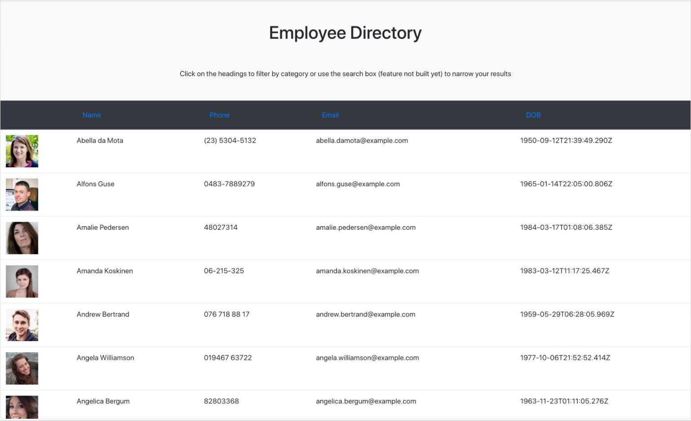

This project was bootstrapped with [Create React App](https://github.com/facebook/create-react-app).

# react-employee-directory

## Description

An employee directory using React. The UI is broken into components, manages component states, and responds to user events. Currently it can sort rows by each header. Future improvements include adding a search function to search by name.

## Table of Contents

* [Installation](#installation)
* [Usage](#usage)
* [License](#license)
* [Contributing](#contributing)
* [Questions](#questions)


## Installation

- All the `code` required to get started

### Clone

- Clone this repo to your local machine using `https://github.com/a-mccaffrey/react-employee-directory.git`

### Setup


> install npm packages

```shell
$ npm install
```

### What it should look like



## Usage

In the project directory, you can run:

### `npm start`

Runs the app in the development mode.<br />
Open [http://localhost:3000](http://localhost:3000) to view it in the browser.

The page will reload if you make edits.<br />
You will also see any lint errors in the console.

### `npm test`

Launches the test runner in the interactive watch mode.<br />
See the section about [running tests](https://facebook.github.io/create-react-app/docs/running-tests) for more information.

### `npm run build`

Builds the app for production to the `build` folder.<br />
It correctly bundles React in production mode and optimizes the build for the best performance.

The build is minified and the filenames include the hashes.<br />
Your app is ready to be deployed!

See the section about [deployment](https://facebook.github.io/create-react-app/docs/deployment) for more information.

### `npm run eject`

**Note: this is a one-way operation. Once you `eject`, you can’t go back!**

If you aren’t satisfied with the build tool and configuration choices, you can `eject` at any time. This command will remove the single build dependency from your project.

Instead, it will copy all the configuration files and the transitive dependencies (webpack, Babel, ESLint, etc) right into your project so you have full control over them. All of the commands except `eject` will still work, but they will point to the copied scripts so you can tweak them. At this point you’re on your own.

You don’t have to ever use `eject`. The curated feature set is suitable for small and middle deployments, and you shouldn’t feel obligated to use this feature. However we understand that this tool wouldn’t be useful if you couldn’t customize it when you are ready for it.


## License

This project is under the MIT license. For full license information, please [click here](https://choosealicense.com/licenses/MIT/). 


## Contributing

> To get started...

### Step 1

- **Option 1**
    - 🍴 Fork this repo!

- **Option 2**
    - 👯 Clone this repo to your local machine using `https://github.com/a-mccaffrey/react-employee-directory.git`

### Step 2

- **HACK AWAY!** 🔨🔨🔨

### Step 3

- 🔃 Create a new pull request using <a href="https://github.com/a-mccaffrey/react-employee-directory.git/compare/" target="_blank">`https://github.com/a-mccaffrey/react-employee-directory.git/compare/`</a>.


## Questions

Want to know more? Look me up on GitHub. My username is a-mccaffrey and my profile is [here](https://www.github.com/a-mccaffrey)

Alternatively, get in touch by emailing me at [aisling.s.mccaffrey@gmail.com](mailto:aisling.s.mccaffrey@gmail.com).